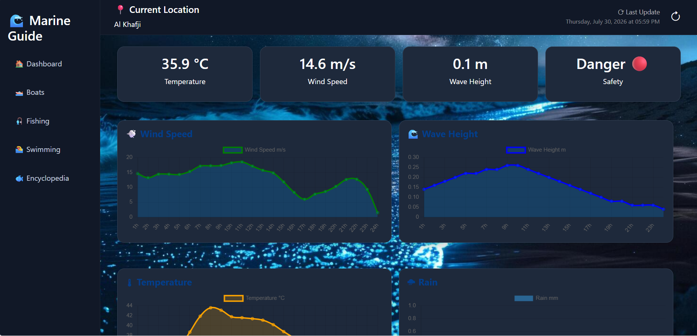

# 🌊 Marine Guide Saudi Arabia

A web-based marine guide platform that helps users explore marine life, check sea conditions, and access safety information for activities such as boating, fishing, and swimming.

The system provides marine weather analysis, activity suitability assessment, marine encyclopedia, and first aid guidance for dangerous marine creatures.

## 🚀 Features

### 🌊 Marine Dashboard

* Displays current marine conditions.
* Provides activity suitability analysis for:

  * 🚤 Boating
  * 🎣 Fishing
  * 🏊 Swimming
* Risk level evaluation based on marine conditions.

### 🌤 Marine Weather Integration

* Real-time weather data retrieval using external APIs.
* Analyzes:

  * Wind speed
  * Wave height
  * Temperature
  * Visibility

### 🐠 Marine Encyclopedia

* Browse marine creatures with:

  * Images
  * Description
  * Habitat locations
  * Breeding seasons
  * Maximum size and age
  * Danger classification

### 🩺 First Aid Guide

* Provides safety instructions for dangerous marine animals:

  * Jellyfish stings
  * Lionfish injuries
  * Stingray injuries
  * Venomous marine species

### 🗺 Interactive Marine Map

* Location-based marine information using map integration.

---

# 🛠 Technical Stack

## Backend

* ASP.NET Core MVC (.NET 9)
* C#
* Entity Framework Core
* LINQ
* Dependency Injection
* RESTful API Integration

## Frontend

* HTML5
* CSS3
* JavaScript
* Bootstrap
* Razor Views (MVC)

## Database

* Microsoft SQL Server
* Entity Framework Core Migrations
* Code First Approach
* Database Relationships:

  * One-to-Many Relationships
  * Foreign Keys
  * Data Seeding

## APIs

* OpenWeather API
* Open-Meteo Marine API

Used external APIs to retrieve marine and weather information and process it inside the application.

# 🗄 Database Design

Main entities:

### Fish

Stores marine species information:

* Name
* Description
* Location
* Danger status
* Edibility
* Category

### Categories

Classifies marine creatures:

* Fish
* Dangerous Species

### FirstAid

Contains emergency instructions related to dangerous creatures.

Database schema includes:

* Primary Keys
* Foreign Keys
* Entity Relationships
* EF Core Migrations

---

# 🔌 API Flow

Example workflow:

```
User Location
      |
      ↓
Marine Weather API
      |
      ↓
Weather Controller
      |
      ↓
Risk Analysis Logic
      |
      ↓

Dashboard Result


## 📸 Screenshots

### Home Page


### Marine Encyclopedia


### First Aid Guide


### Boats


### Fishing


### Map


### Fish


### Details


# 🎯 Skills Demonstrated

* Full-stack web development using ASP.NET Core MVC
* REST API consumption and integration
* Database design with SQL Server
* Entity Framework Core migrations
* MVC architecture
* Frontend development with Bootstrap and JavaScript
* External service integration
* Data modeling and relationships
* Problem solving and debugging


# 👩‍💻 Developer

Shahd
Software Engineer
