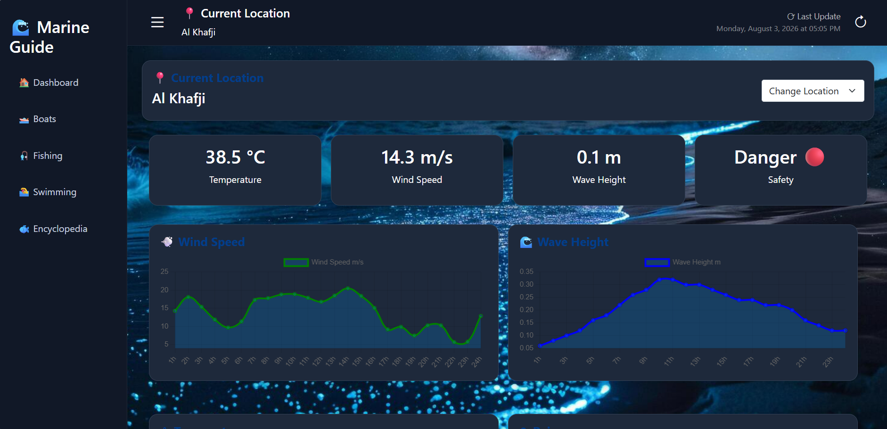
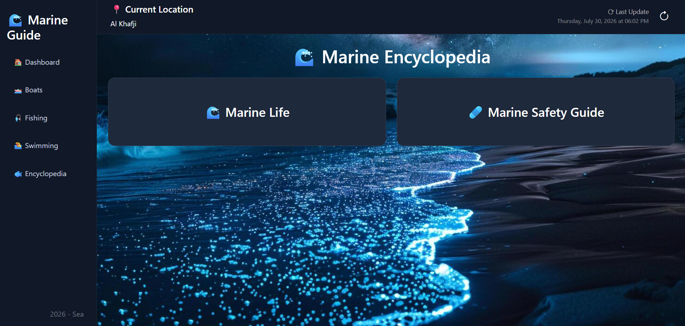
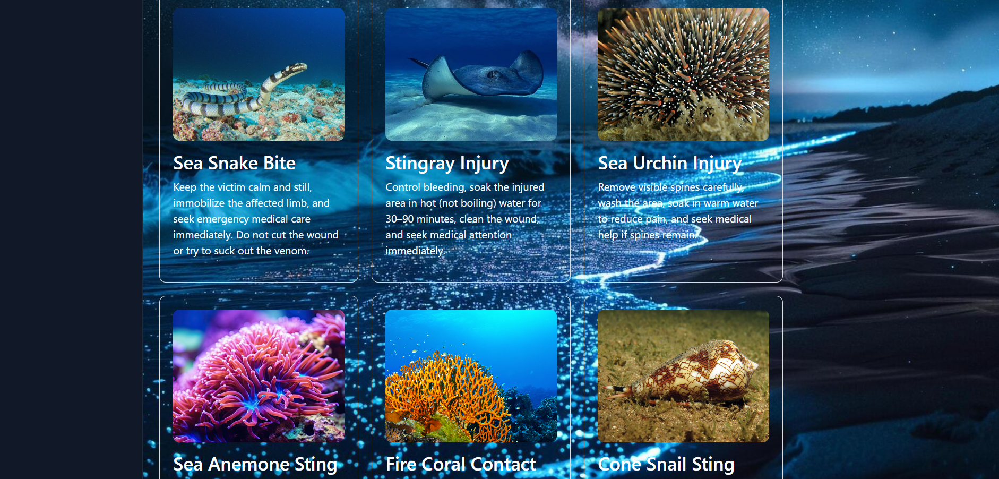
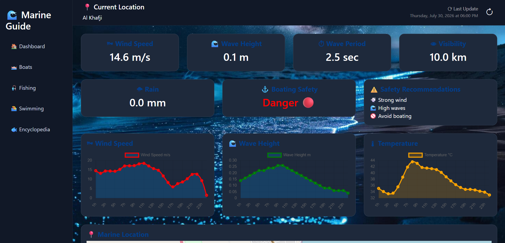
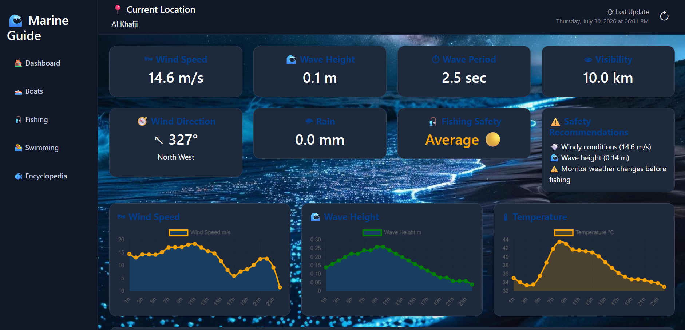
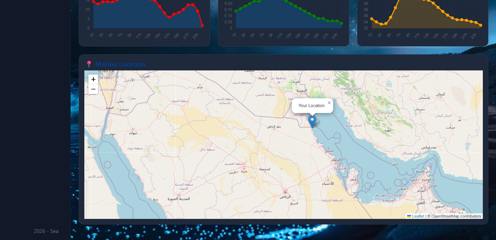
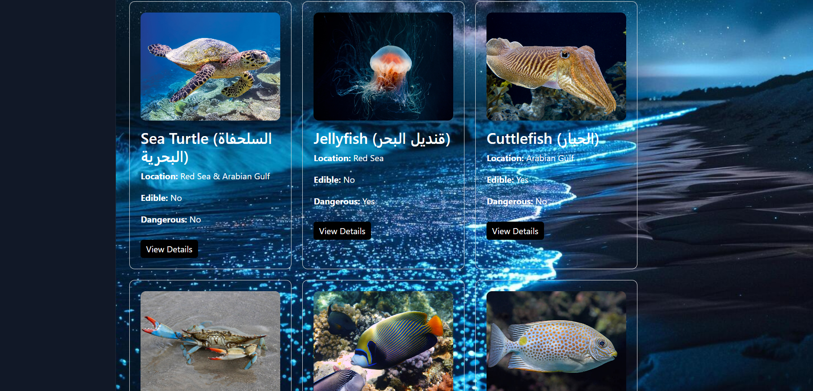
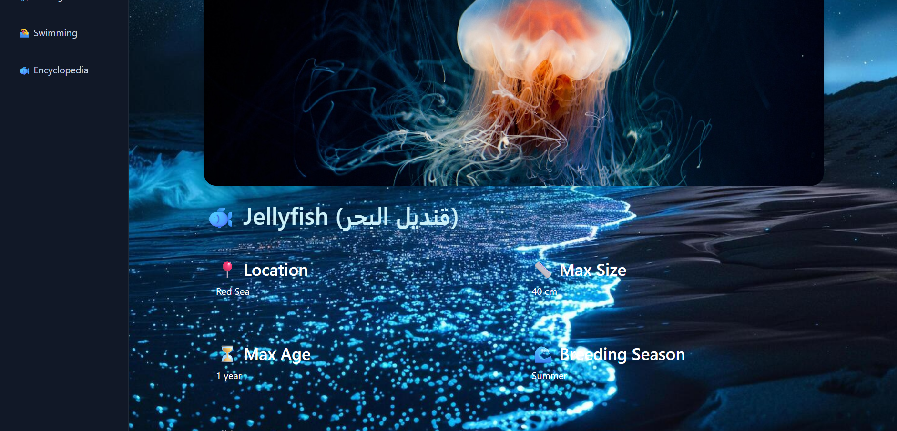

# 🌊 Marine Guide Saudi Arabia

A web-based marine guide platform that helps users explore marine life, analyze sea conditions, and access safety information for marine activities.

The system provides marine weather analysis, activity suitability prediction, marine encyclopedia, and first aid guidance for dangerous marine creatures.

---

# 🚀 Features

## 🌊 Marine Dashboard

The dashboard analyzes marine conditions and evaluates activity suitability for:

- 🚤 Boating
- 🎣 Fishing
- 🏊 Swimming

The system calculates risk levels based on:

- Wind speed
- Wave height
- Temperature
- Visibility

---

## 🌤 Marine Weather Integration

The application integrates external APIs to retrieve marine and weather information:

- OpenWeather API
- Open-Meteo Marine API

The received data is processed using custom risk analysis logic to provide suitable activity recommendations.

---

## 🐠 Marine Encyclopedia

Users can explore marine creatures with detailed information:

- Name
- Image
- Description
- Habitat location
- Breeding season
- Maximum size
- Maximum age
- Danger classification
- Prevention instructions

---

## 🩺 First Aid Guide

Provides safety instructions for dangerous marine creatures:

- Jellyfish stings
- Lionfish injuries
- Stingray injuries
- Venomous marine species

---

## 🗺 Interactive Marine Map

Provides location-based marine information using map integration.

---

# 🛠 Technical Stack

## Backend

- ASP.NET Core MVC (.NET 9)
- C#
- Entity Framework Core
- LINQ
- Dependency Injection
- MVC Architecture
- REST API Integration

## Frontend

- HTML5
- CSS3
- JavaScript
- Bootstrap
- Razor Views

## Database

- Microsoft SQL Server
- Entity Framework Core Code First
- EF Core Migrations
- Data Seeding
- Database Relationships

Database design includes:

- Primary Keys
- Foreign Keys
- One-to-Many Relationships

---

# 🗄 Database Design

Main entities:

## Fish

Stores marine creature information:

- Name
- Description
- Location
- Danger status
- Edibility
- Size
- Age

## Categories

Classifies marine creatures:

- Fish
- Dangerous Species

## FirstAid

Stores emergency instructions related to dangerous creatures.

---

---

# 📸 Screenshots

## Home Page

## Marine Encyclopedia

## First Aid Guide

## Boats

## Fishing

## Interactive Map

## Fish

## Details

---

# 🎯 Skills Demonstrated

- Full-stack web development using ASP.NET Core MVC
- REST API consumption and integration
- SQL Server database design
- Entity Framework Core migrations
- Code First approach
- Data modeling and relationships
- Bootstrap responsive UI
- JavaScript API communication
- External service integration
- Debugging and problem solving

---

# 👩‍💻 Developer

**Shahd**  
Software Engineer
