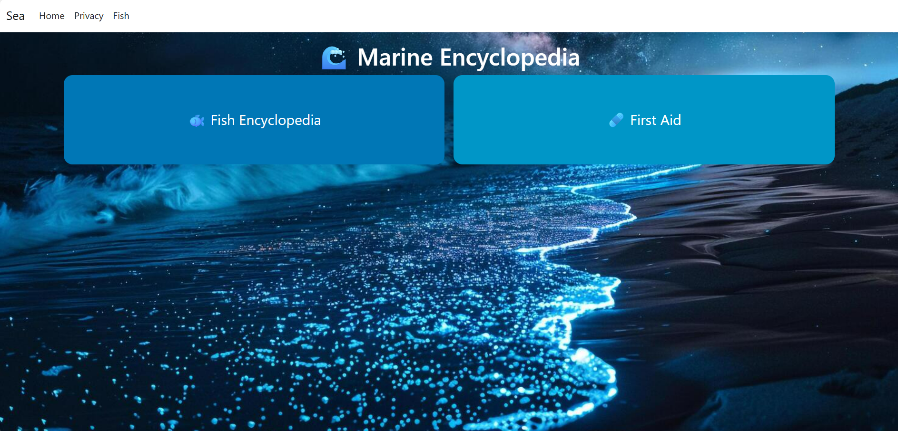
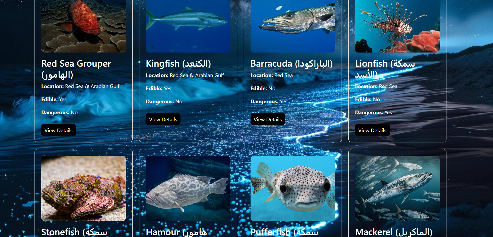
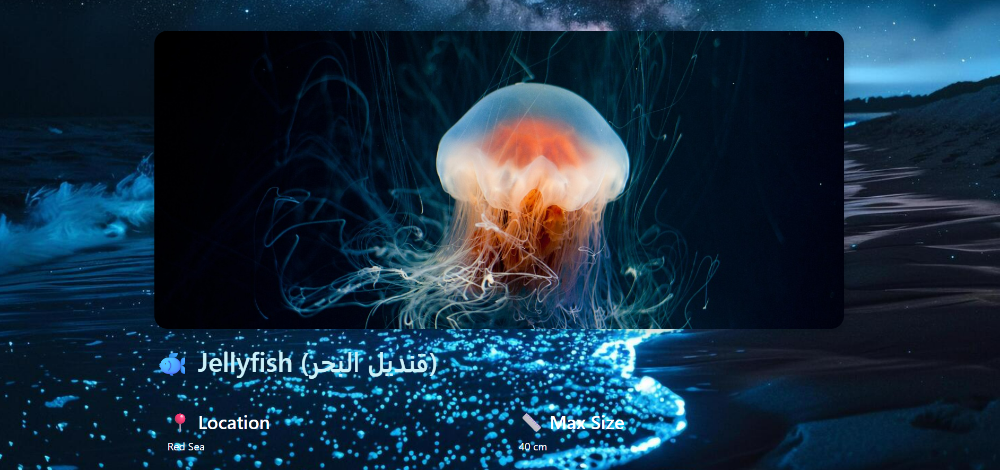
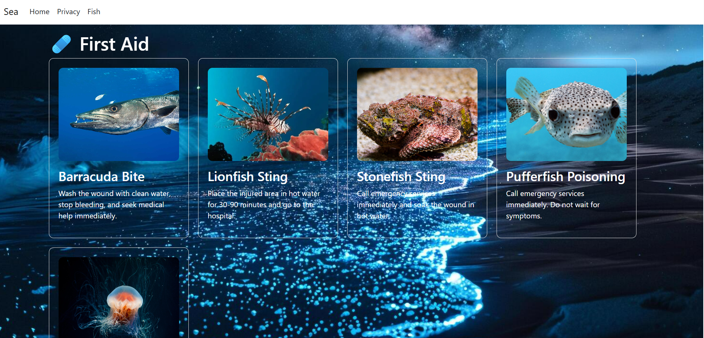

<<<<<<< HEAD
# 🌊 Marine Guide Saudi Arabia

Marine Guide Saudi Arabia is an ASP.NET Core MVC web application designed to help users explore marine activities, check sea conditions, and learn about marine life and safety.

## Features

### Marine Weather Analysis
- Real-time weather data using OpenWeather and StormGlass APIs.
- Sea condition evaluation based on:
  - Wind speed
  - Wave height
  - Visibility
- Safety recommendations for:
  - Swimming 🏊‍♀️
  - Boating 🚤
  - Fishing 🎣

### Marine Encyclopedia
- Explore different marine species.
- View detailed information and images about marine animals.

### First Aid Guide
- Provides important first aid information for marine-related incidents.

### 📍 Interactive Map
- Detects user location using GPS.
- Displays marine activity information based on location.

## Location-Based Weather Analysis
The system uses the user's location to provide marine weather information and analyze sea conditions
for different activities such as swimming, fishing, and boating.
## Development Status
This project is currently under development. More features and improvements will be added in future updates.

## Screenshots

### Home Page

### Marine Encyclopedia

### Marine Animals

### Marine Animal Details

### First Aid Guide

### Map

## Built With
- ASP.NET Core MVC
- Entity Framework Core
- SQL Server
- C#
- HTML / CSS / JavaScript
- Leaflet.js
- OpenWeather API
- StormGlass API

## Purpose

The project aims to provide users with a smart marine assistant that improves safety awareness and supports marine activities through weather analysis and educational resources.
=======

>>>>>>> 01a3fbf (Add project README)
